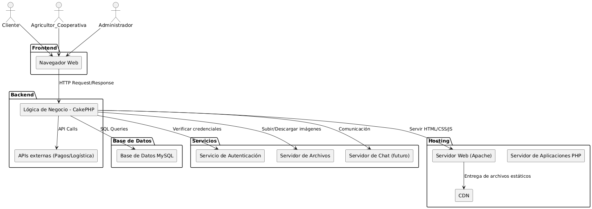
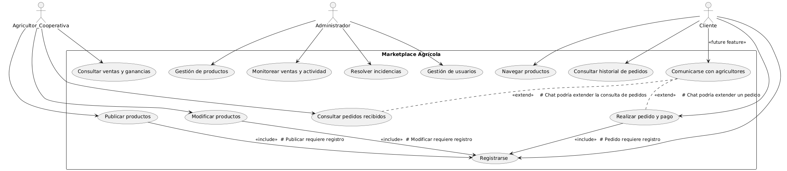
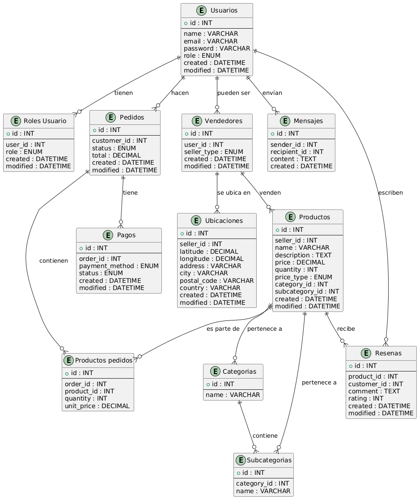

# FASE DE DISEÑO

- [FASE DE DISEÑO](#fase-de-diseño)
  - [1- Diagrama de la arquitectura](#1--diagrama-de-la-arquitectura)
  - [2- Casos de uso](#2--casos-de-uso)
  - [3- Diagrama de Base de Datos](#3--diagrama-de-base-de-datos)
  - [4- Diseño de interfaz de usuarios](#4--diseño-de-interfaz-de-usuarios)

## 1- Diagrama de la arquitectura

## 2- Casos de uso

## 3- Diagrama de Base de Datos

Modelo inicial de base de datos:

## 4- Diseño de interfaz de usuarios

El prototipo figma está subido en la carpeta prototipos.